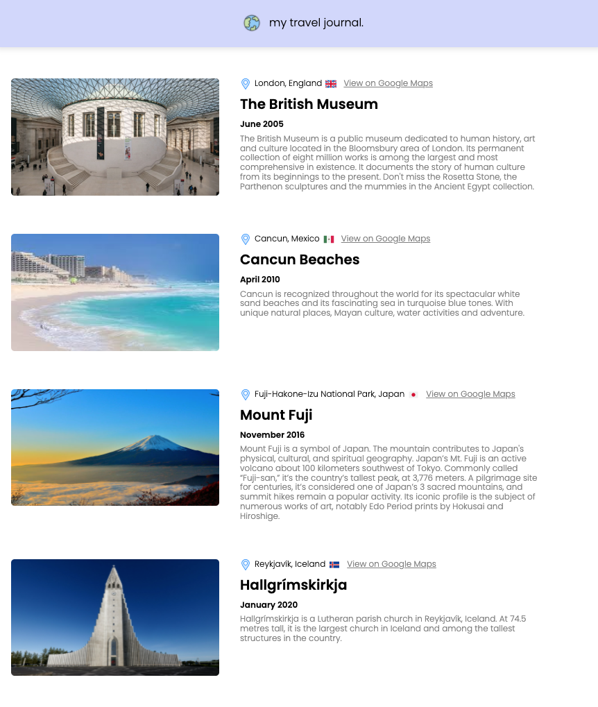

# Travel Journal

I love traveling and I love coding. So for my next React project, I built a simple travel journal of international places I've been to.

Topics covered:

- [x] Components & Props
- [x] Data flow through props
- [x] Mapping: use array maps with JSX to create mutiple components
- [x] Conditioning on HTML elements with props

